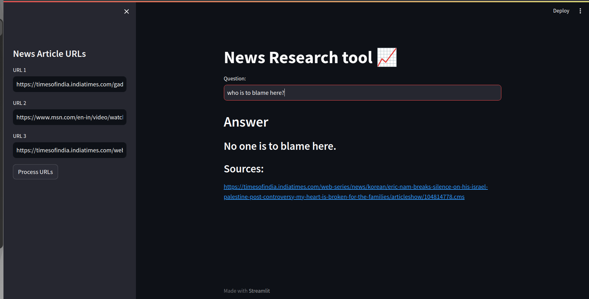

# News Research Tool


 ## Installation (Linux)
## Clone
```bash
$ git clone https://github.com/shreyahegde18/News-Research-Tool.git
```
## Activate Virtual Environment
```
$ source venv/bin/activate
```

## or Create a new Virtual Environment and install requirements.txt
```bash
$ python3 -m venv venv
$ pip install -r requirements.txt
```

## OpenAI Key
Get your own [OpenAI API Key](https://openai.com/)

Add your openapi_key [here](secrete.py)

## Run with Streamlit
```bash
$ streamlit run main.py
```
### feel free to customize :)
